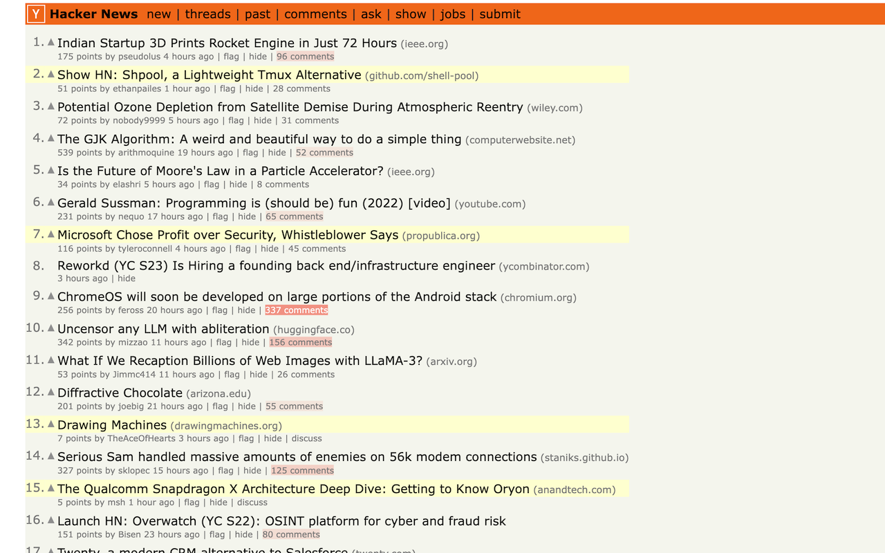

# Hacker-News-Highlighter

If you are like me, reloading the HackerNews frontpage (https://news.ycombinator.com/news) multiple times a day scanning for any interesting distraction, this Google Chrome extension is for you:

It highlights any new article since your last visit, making it quick and easy to scan for any news. It also highlights the number of comments per article once they surpass 50 comments, making it easy to spot highly discussed articles.

